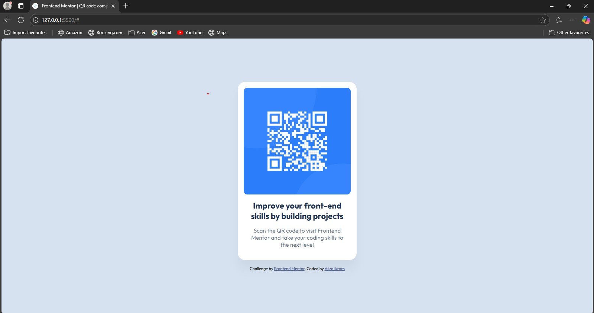
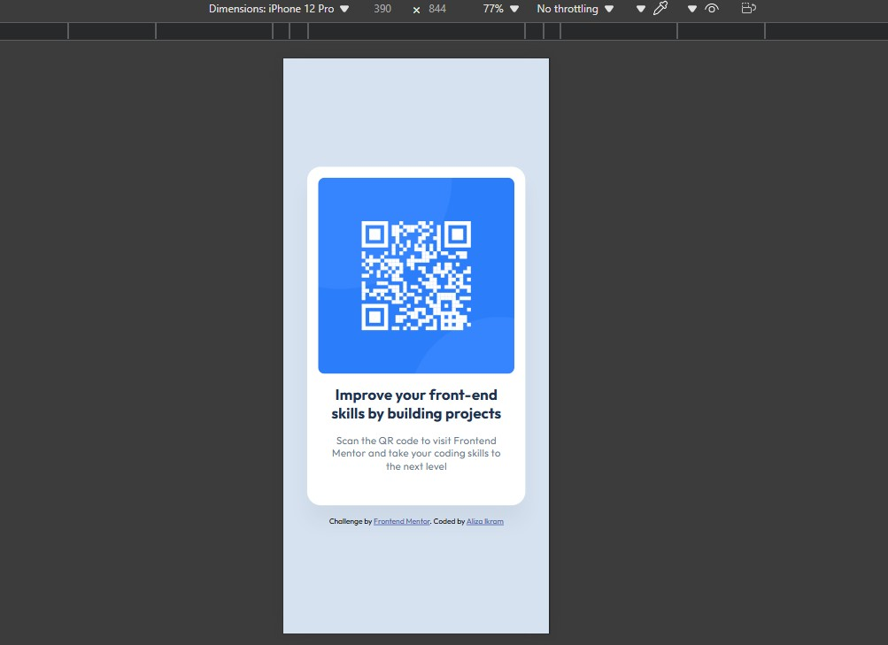

# Frontend Mentor - QR code component solution

This is a solution to the [QR code component challenge on Frontend Mentor](https://www.frontendmentor.io/challenges/qr-code-component-iux_sIO_H). Frontend Mentor challenges help you improve your coding skills by building realistic projects. 

## Table of contents

  - [Overview](#overview)
  - [Screenshot](#screenshot)
  - [Links](#links)
  - [Built with](#built-with)
  - [What I learned](#what-i-learned)
  - [Continued development](#continued-development)
  - [Useful resources](#useful-resources)
  - [Author](#author)

## Overview

This project showcases a custom-designed QR code created using HTML and CSS. It demonstrates how to style and enhance a basic QR code with creative design elements. This repository is intended for learning and experimenting with front-end development techniques.

### Screenshots

### Links

- Solution URL: [https://www.frontendmentor.io/solutions/responsive-qr-code-component-l65qsJXOge]
- Live Site URL: [https://simple-qrcode-component.netlify.app/]

### Built with

- Semantic HTML5 markup
- CSS custom properties
- Flexbox
- Mobile-first workflow

### What I learned

I learned how to build code with well structure because i've been troubled with this a lot lately. I also learned a lot by using the figma reference and tried my best to make it as similar as possible. I also made this responsive without using media-queries.

### Continued development

I'm a novice so I want to continue learning how to make the code well structure and make it responsive also. Also, CSS properties are very vast so I have to build a strong foundation in this too.

### Useful resources

- [Example resource 1](https://www.youtube.com/watch?v=MOsWTckRPfk) - This helped me understanding the well structure approach. I really liked this pattern and will use it going forward.
- [Example resource 2](https://coddy.tech/courses/coddy_profile_card_clone__frontend_project) - This is an site which helped me finally understand how to style the web step by step. It can improve foundations in CSS. I'd recommend it to anyone still learning this concept.

## Author

- Linkedin - [Aliza Ikram](www.linkedin.com/in/aliza-ikram)
- Frontend Mentor - [AlizaIkram](https://www.frontendmentor.io/profile/AlizaIkram)
